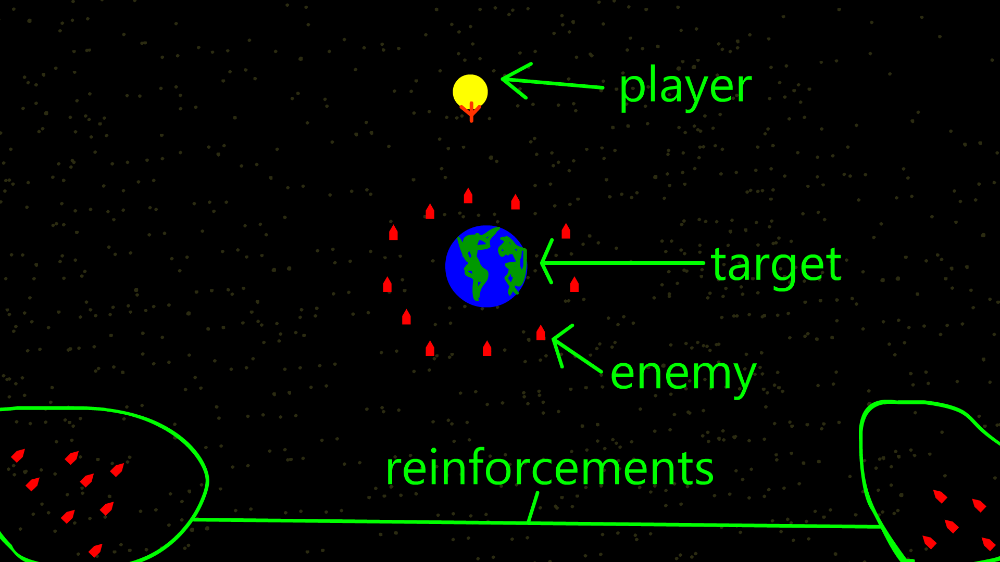
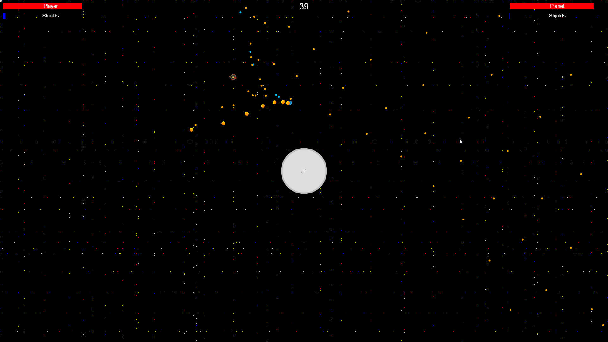
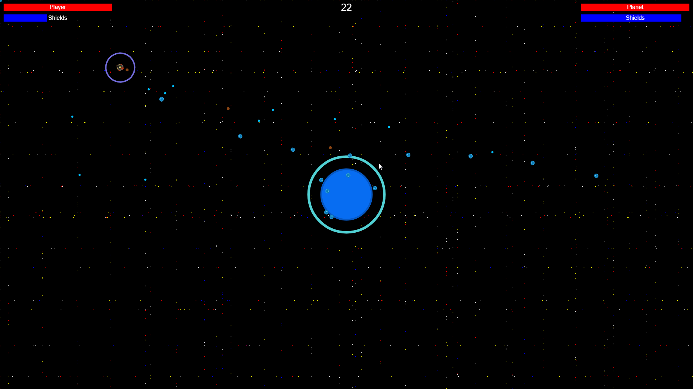
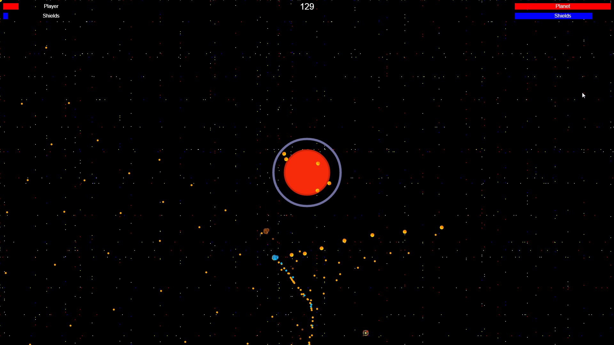

How to Play
=======
* WASD to move
* Hold to shoot
* P to pause
* M to mute
* Kill the planet as quickly as possible, and try and kill a lot of enemies too
* Recommended minimum window size: 1485 x 690

Todo
=====
- [X] Make Player fire shoot like a flamethrower, insane RoF, but bullets die at short distance. 
- [X] Convert sounds to code with [this](https://github.com/mneubrand/jsfxr)
- [X] Different enemy types do and take different damage.
- [X] Air should be like a blast wave and pushes targets back. 
- [X] Rock penetrates. 
- [X] Tinker with sounds to make better ones. To do so, go [here](http://www.superflashbros.net/as3sfxr/), get a sound you want, hit CTRL+C, and paste that over whatever sound you want to replace in sounds.
- [X] Powerups.  
- [ ] Fire should burn for a few seconds. 
- [ ] Water does splash damage, slows targets.  

Earth Invader
=====

Years ago, a terrible invasion by unknown entities was staved off by a lone Earth ship. Now, in the year 2048, humankind has discovered the planets of the coalition that nearly wiped them out, and has elected to send their most skilled pilot to destroy them: you.

Mockup
=====

Screenshots
=====

Credits
=========

Created by Rudhra Raveendran, Andrew Lee, Phillip Sifferlen, Matthew Chuang, and Zach Day.

Special thanks to Benjamin Pelon for the sprites!
