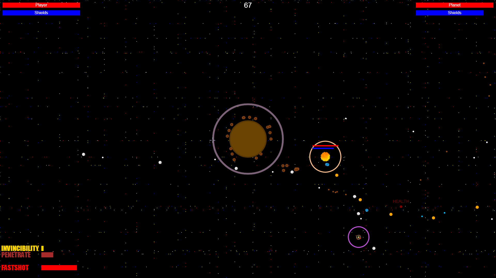
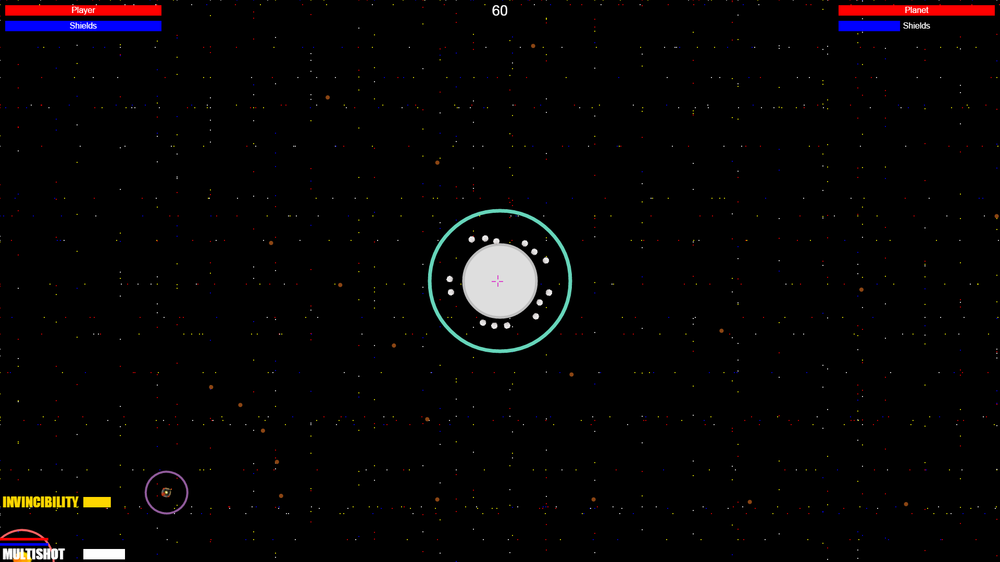
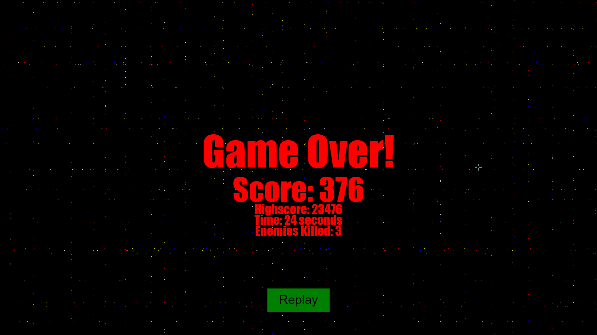

Todo
=====
- [ ] Port game to phaser for 2099 edition
- [ ] Have expanded playing space, have it be same no matter what size screen (extend beyond bounds of screen)
- [ ] Multiplayer support (pvp? coop would make most sense)
- [ ] Upgrades, new enemy types, more varied enemy types, new powerups and weapons, different ships with different stats
- [ ] new gameplay (in atmosphere raids after taking down shields?)
- [ ] have a server (heroku?) to show leaderboard stats

How to Play
=======
* WASD to move
* Hold to shoot
* P to pause
* Kill the planet as quickly as possible, and try and kill a lot of enemies too
* Recommended minimum window size: 1485 x 690

Earth Invader
=====

Years ago, a terrible invasion by unknown entities was staved off by a lone Earth ship. Now, in the year 2048, humankind has discovered the planets of the coalition that nearly wiped them out, and has elected to send their most skilled pilot to destroy them: You. 

Wonder why there's no sound? In space, you won't hear your enemies dying.

Screenshots
=====

Credits
=========

Created by Rudhra Raveendran, Andrew Lee, Phillip Sifferlen, Matthew Chuang, and Zach Day.

Special thanks to Benjamin Pelon for the sprites!
